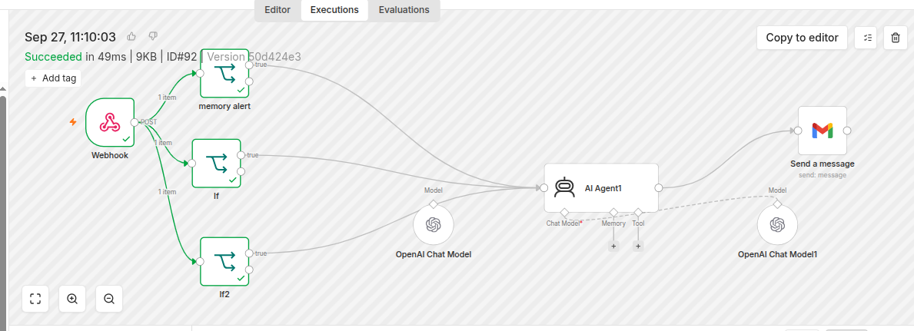

# AI-Powered Laptop Monitoring and Alerting System

An AIOps project that monitors Ubuntu system health using Bash, n8n Cloud, AI-powered analysis, and Gmail alerts.

## Project Overview

This project continuously monitors an Ubuntu laptop and sends automated alerts when system resource usage crosses predefined thresholds.

Bash collects system metrics, n8n processes the monitoring data, and an AI Agent generates troubleshooting insights delivered through Gmail.

## Architecture

Ubuntu Laptop → Bash Monitoring Script → n8n Webhook → Threshold Checks → AI Agent → Gmail Alert

## Workflow Screenshot


## Technologies Used

- Linux (Ubuntu)
- Bash scripting
- n8n Cloud
- Webhooks and JSON
- Cron
- AI Agent / LLM integration
- Gmail

## Features

- CPU idle percentage and system load monitoring
- RAM and swap usage monitoring
- Root filesystem disk usage monitoring
- Automated metric collection every 5 minutes
- Independent CPU, memory, and disk threshold checks
- AI-generated troubleshooting recommendations
- Automated Gmail notifications

## Alert Thresholds

| Resource | Alert Condition |
|---|---|
| CPU | CPU idle below 15% |
| Memory | Available memory below 15% of total |
| Disk | Root filesystem usage above 85% |

## Project Structure

```text
aiops-laptop-monitoring/
├── laptop-monitor.sh
├── README.md
├── n8n-workflow/
└── screenshots/
```

## Security

- Do not commit webhook URLs, tokens, passwords, or API keys.
- Configure your own n8n webhook URL and monitoring token.
- Configure Gmail and AI credentials directly in n8n.
- Review workflow exports and screenshots before publishing.

## Future Enhancements

- Historical monitoring dashboard
- Alert deduplication and recovery notifications
- Prometheus and Grafana integration
- Process-level and network monitoring
- More advanced anomaly detection

## Disclaimer

This is a learning and portfolio project. Validate AI-generated troubleshooting recommendations before executing commands on production systems.
